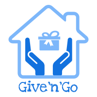

<p align="center">
  
</p>

[](https://github.com/GiveNGo/GiveNGo)


# GiveNGo

React Native application to connect people in need of goods and services in trying times.

## Version 1.0+ - GiveNGo Application Launch!

- Code of Conduct to instill values and principals that users are expected to uphold when using GiveNGo
- Sleek mobile experience using UI-Kitten
- Seamless page transitions using React Navigation
- Now works on multiple mobile platforms

## Core Features

  <!-- * HTTP request tracing -->

- Dynamic chatroom to allow users to communicate on open tasks
- Includes dynamic map to update users on available tasks
- Karma System to reward users for any good deeds performed

## Quick start

#### Install dependencies

```
npm install
```

#### Launch your application

```
npm run both
```

## License

GiveNGo is [MIT licensed.](https://github.com/GiveNGo/GiveNGo/blob/master/LICENSE.md)
